# Overview

This project is CI/CD implementation to a machine learning prediction web app, The ML model predict houses prices in boston, the web app provide the possibility to use the web app. The CI was written in Github actions, and the CD was created in azure piplines in order to deploy the app automatically.

## Project Plan

* Trello: https://trello.com/invite/b/13PItVH1/f0c224215756538780db65d07f9ae8d3/flask-ml-service
* Spreadsheet: https://docs.google.com/spreadsheets/d/13cX4DH-fLO3dnYwvKFL5S0ttys6NyaRdHwN15iVTL0w/edit?usp=sharing

## Instructions

* Architectural Diagram (Shows how key parts of the system work)
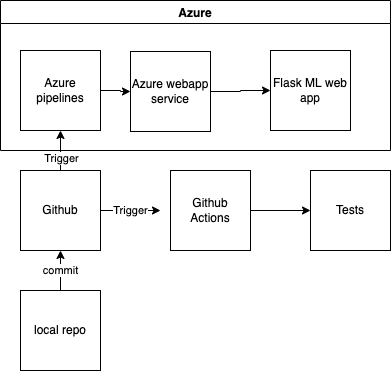


* Project running on Azure App Service
```
odl_user@Azure:~$ az webapp up --name my-flask-ml-service-96 --resource-group Azuredevops --runtime "PYTHON:3.7"
```
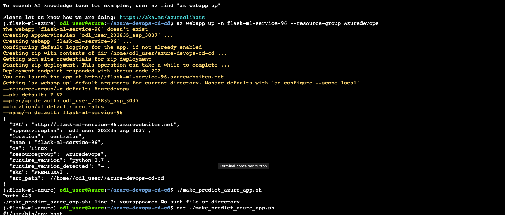
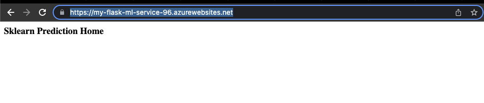

* Project cloned into Azure Cloud Shell
```
git clone https://github.com/AmrAnwar/azure-devops-cd-cd
```
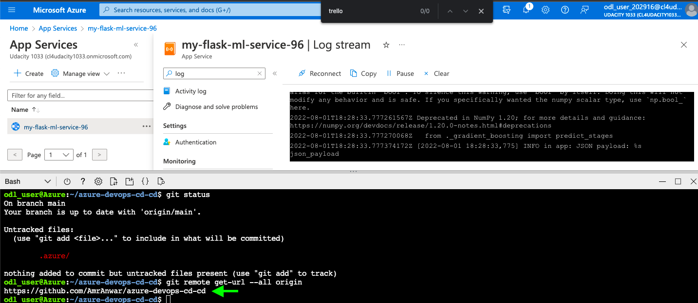
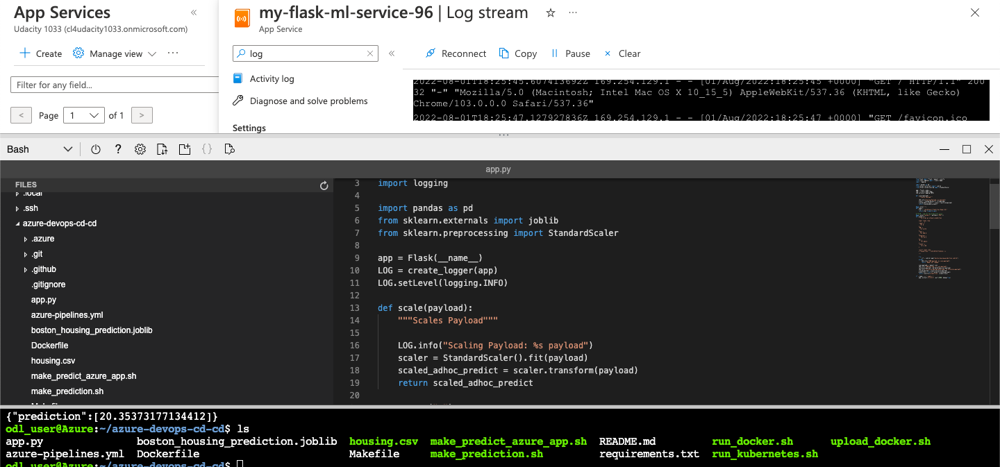

* Passing tests that are displayed after running the `make all` command from the `Makefile`
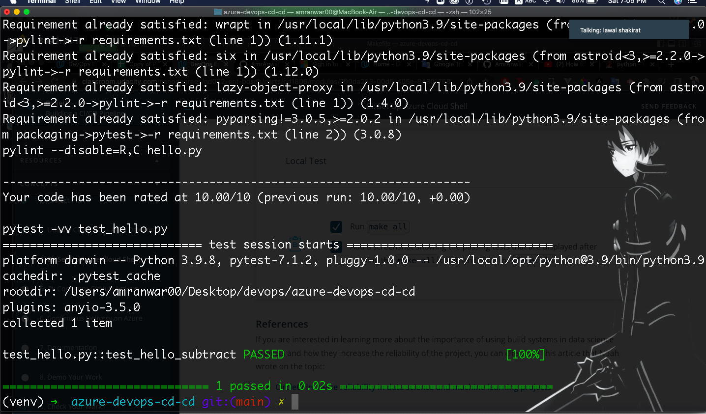

* Output of a test run
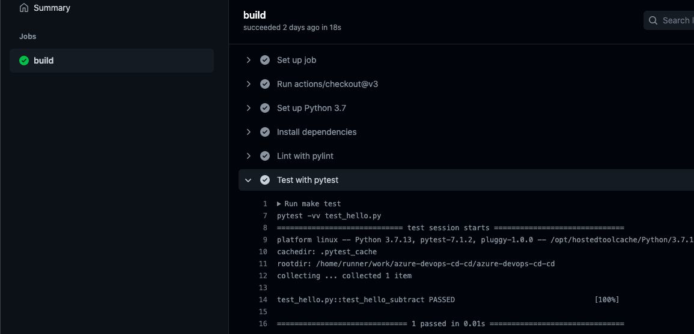


* Successful deploy of the project in Azure Pipelines.

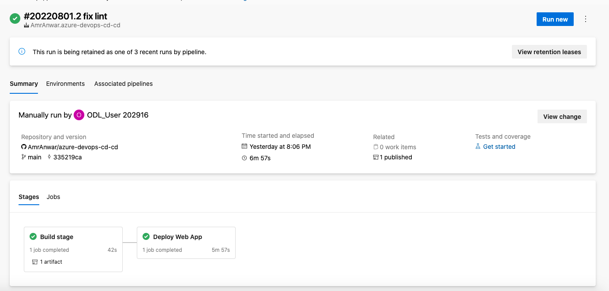


* Running Azure App Service from Azure Pipelines automatic deployment

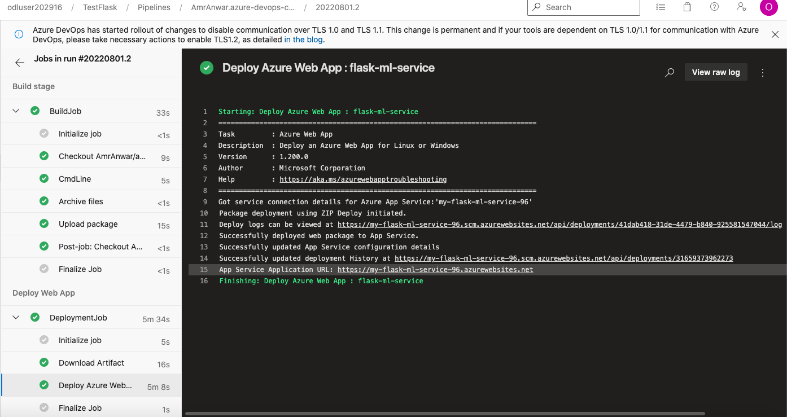

* Successful prediction from deployed flask app in Azure Cloud Shell. 
```bash
odl_user@Azure:~/azure-devops-cd-cd$ ./make_predict_azure_app.sh 
Port: 443
{"prediction":[20.35373177134412]}
```
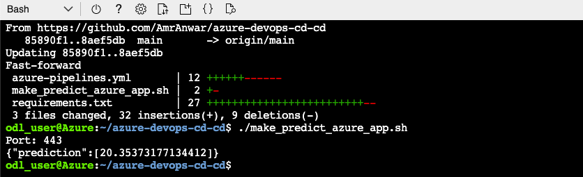


* Output of streamed log files from deployed application

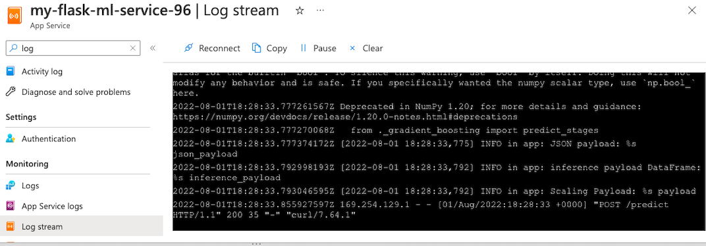


## Enhancements

In the future and next agile iterations, frontend could be added to access the API more easily, In addition to that cloud alerts and policies can be added as well to make sure the server is running without problems. Finally also creating monitoring the services would help following up the changing and requests to the services.

## Demo 

<TODO: Add link Screencast on YouTube>


